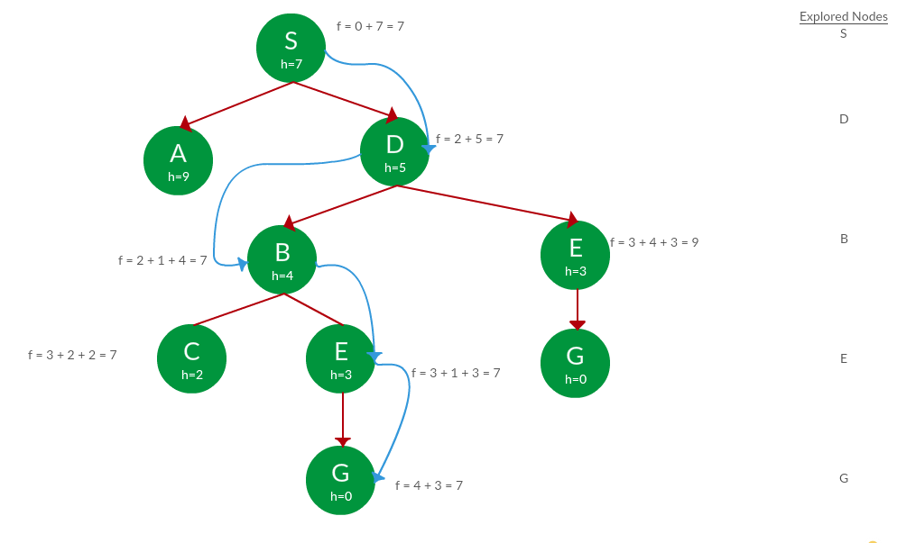

  <h1 align="center">A* PATH FINDING ALGORITHM VISUALIZATION USING PYGAMES</h1>

  
Table of Contents

  <ol>
    <li>
      <a href="#about-the-project">About The Project</a>
      <ul>
        <li><a href="#built-with">Built With</a></li>
      </ul>
    </li>
    <li><a href="#the-algorithm">The Algorithm</a></li>
    <li><a href="#visualization-using-pygames">Visualization Using Pygames</a></li>
    <li><a href="#usage">Usage</a></li>
    <li><a href="#future-updates">Future Updates</a></li>
    <li><a href="#resources">Resources</a></li>
    <li><a href="#license">License</a></li>
  </ol>

## About The Project

Pathfinding is the plotting of the shortest route between two points. It generally involves solving mazes. At it's core a pathfinding method searches a graph by starting at one vertex and exploring adjacent nodes until the destination node is reached, generally with the intent of finding the cheapest route. 

In this project, I have showed how A* Search Algorithm finds the shortest path using Python 3.7 visualization library.

### Built With

This section lists any major technologies that I built this project using. Here are a few examples.
* Python
* Pygames
* Graph Theory

## The Algorithm

A* is basically an informed search algorithm and is considered a "best first search" algorithm because it greedily chooses which vertext to explore next. What A* Search Algorithm does is that at each step it picks the node according to a value-‘f’ which is a parameter equal to the sum of two other parameters – ‘g’ and ‘h’. At each step it picks the node/cell having the lowest ‘f’, and process that node/cell.

We define ‘g’ and ‘h’ as simply as possible below

g = the movement cost to move from the starting point to a given square on the grid, following the path generated to get there. 

h = the estimated movement cost to move from that given square on the grid to the final destination. This is often referred to as the heuristic, which is nothing but a kind of smart guess.

  

Starting from S, the algorithm computes g(x) + h(x) for all nodes in the fringe at each step, choosing the node with the lowest sum.

  

Path: S -> D -> B -> C -> E -> G 

Cost: 7 

_For more examples, please refer to the [Documentation](https://www.geeksforgeeks.org/a-search-algorithm/)_

## Visualization Using Pygames

Now we need to visualize it and luckily for us Python 3.7 has such a library ~~no not tkiner i hate tkinter~~ called Pygames. For some reason Pygames just wasn't there in 3.9 idk.

  

## Usage

This section walks you through the process of using the code:

Run main.py and you will see this window pop up.

  

Left Click anywhere on the window to select start node and end node.

  

Add barriers using the left mouse button.

  

Use right mouse button to remove barriers and change nodes.

  

Hit 'SPACE' to run.

  

Hit 'C' to clear the board.

  

## Future Updates

I am planning on adding the following things in the future:

1. More algorithms for maze solving.
2. Options bar to select those algorithms.
3. Maybe host it on a cloud server using React.
4. Add instructions on screen.

## Resources

* [Geeks for geeks](https://www.geeksforgeeks.org/search-algorithms-in-ai/)
* [Tech with Tim](https://www.youtube.com/c/TechWithTim)
* [Pygames](https://www.pygame.org/docs/)
* [Stack Overflow](https://stackoverflow.com/)

## LICENSE

Distributed under the MIT License. See `LICENSE` for more information.

